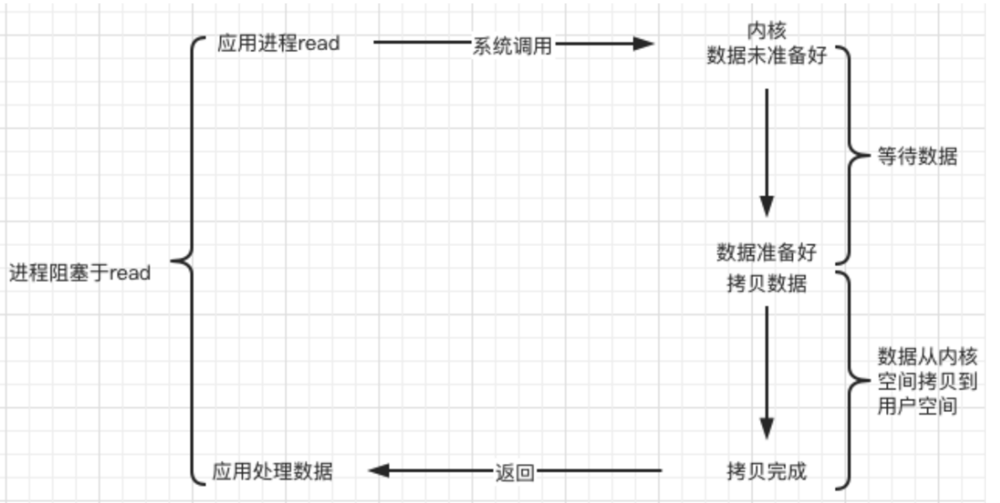
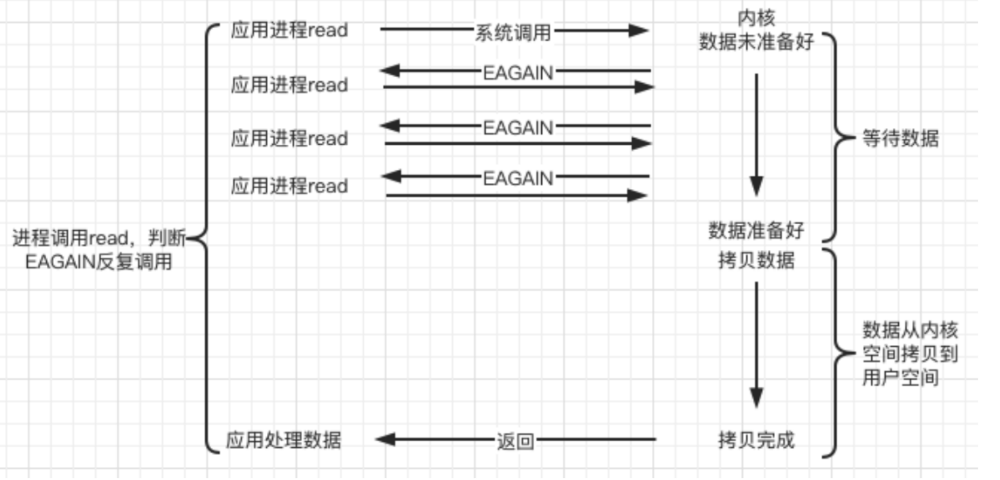
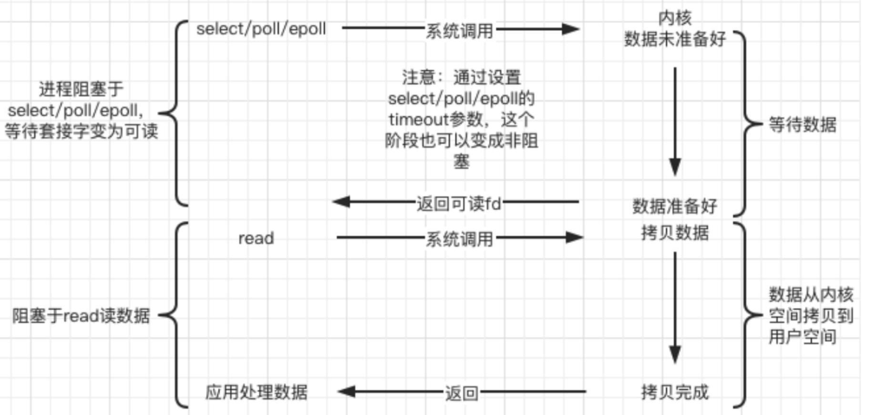
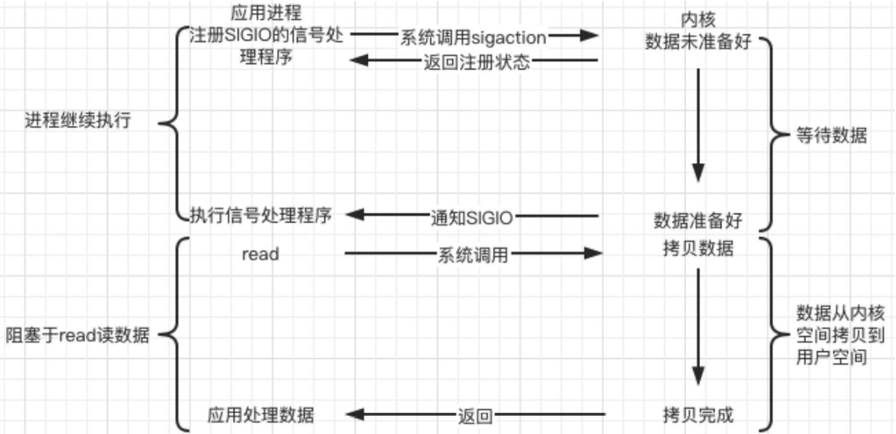
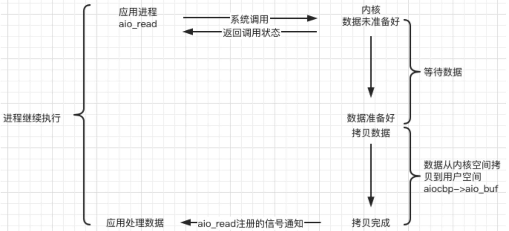

# 五种IO模型

###1. 阻塞IO
调用者调用了某个函数，等待这个函数返回，期间什么也不做，不停的去检查这个函数有没有返回，必
须等这个函数返回才能进行下一步动作。

### 2.非阻塞IO
非阻塞等待，每隔一段时间就去检测 IO 事件是否就绪。没有就绪就可以做其他事。非阻塞 I/O 执行系统调用总是立即返回，不管时间是否已经发生，若时间没有发生，则返回-1，此时可以根据 errno 区分这两种情况，对于 accept，recv 和 send，事件未发生时，errno 通常被设置成 eagain。

### 3.IO复用
linux 用select/poll/epoll 函数实现 IO 复用模型，这两个函数也会使进程阻塞，但是和阻塞 IO 所不同的是这两个函数可以同时阻塞多个 IO 操作。而且可以同时对多个读操作、写操作的 IO 函数进行检测。知道有数据可读或可写时，才真正调用 IO 操作函数。

### 4.信号驱动IO
Linux 用套接口进行信号驱动 IO，安装一个信号处理函数，进程继续运行并不阻塞，当 IO 事件就绪，进程收到 SIGIO 信号，然后处理 IO 事件。内核在第一个阶段是异步，在第二个阶段是同步。与非阻塞 IO 的区别在于它提供了消息通知机制，不需要用户进程不断的轮询检查，减少了系统 API 的调用次数，提高了效率。 

### 5.异步IO
Linux 中，可以调用 aio_read 函数告诉内核描述字缓冲区指针和缓冲区的大小、文件偏移及通知的方式，然后立即返回，当内核将数据拷贝到缓冲区后，再通知应用程序。Windows中是IOCP。

# 数据就绪和数据读写

一个典型的网络IO接口调用，分为两个阶段，分别是“数据就绪”和“数据读写”：
* 数据就绪：指的是系统IO的就绪状态。
    * 阻塞：阻塞当前线程
    * 非阻塞：直接返回。
* 数据读写：指的是应用程序和内核之间的交互方式，比如A向B请求调用一个网络IO接口时（或者调用某个业务逻辑API接口时），不同的处理。
    * 同步IO：数据的读写都是由请求方A自己来完成的（不管是阻塞还是非阻塞）。此时内核向应用程序通知的是就绪事件。
    > 阻塞I/O，非阻塞I/O，信号驱动I/O和I/O复用都是同步I/O。
    * 异步IO：A向B传入请求的事件以及事件发生时通知的方式，A就可以处理其它逻辑了，当B监听到事件处理完成后，会用事先约定好的通知方式，通知A处理结果。即数据在用户和内核空间的转移由内核完成。此时内核向应用程序通知的是完成事件。

简单来说，只有使用了特殊的 API 才是异步 IO。

