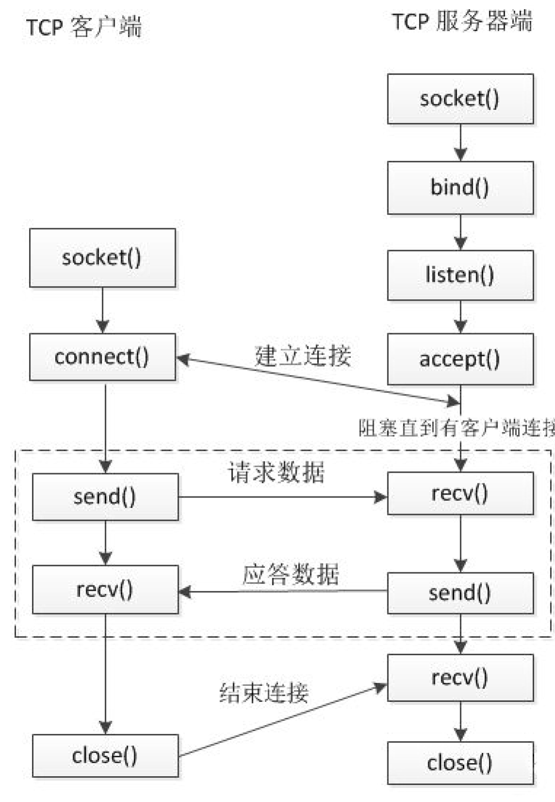
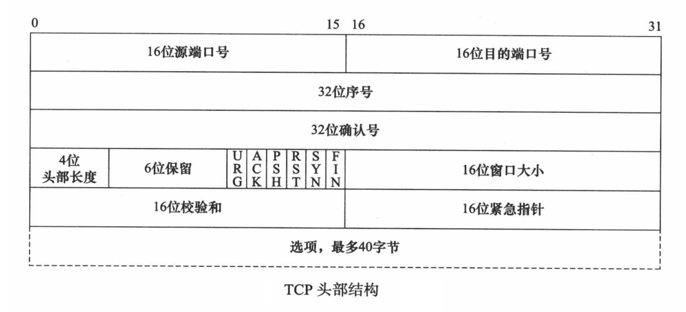
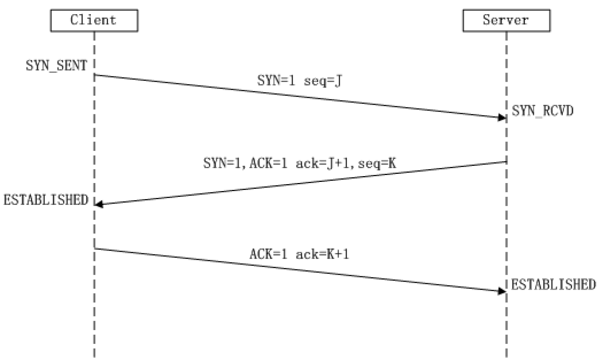
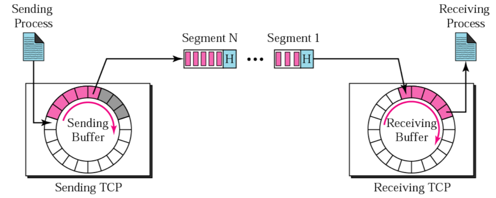
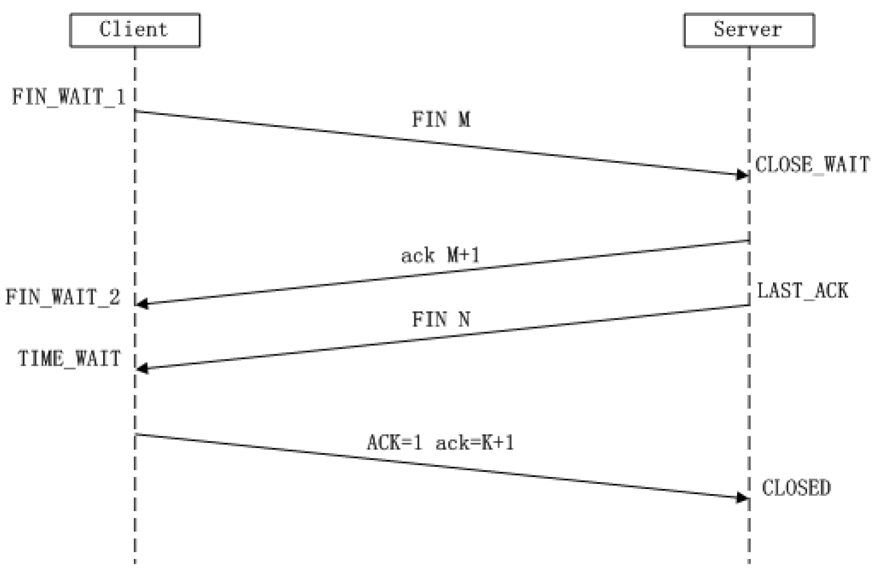
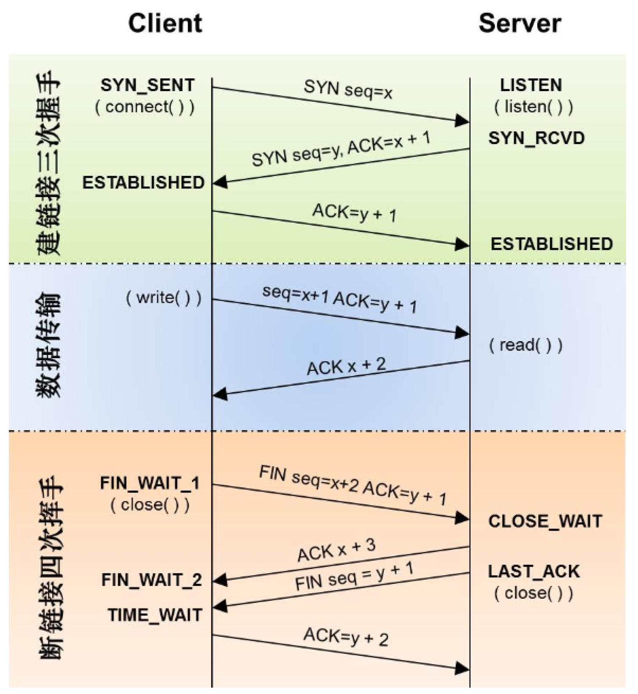
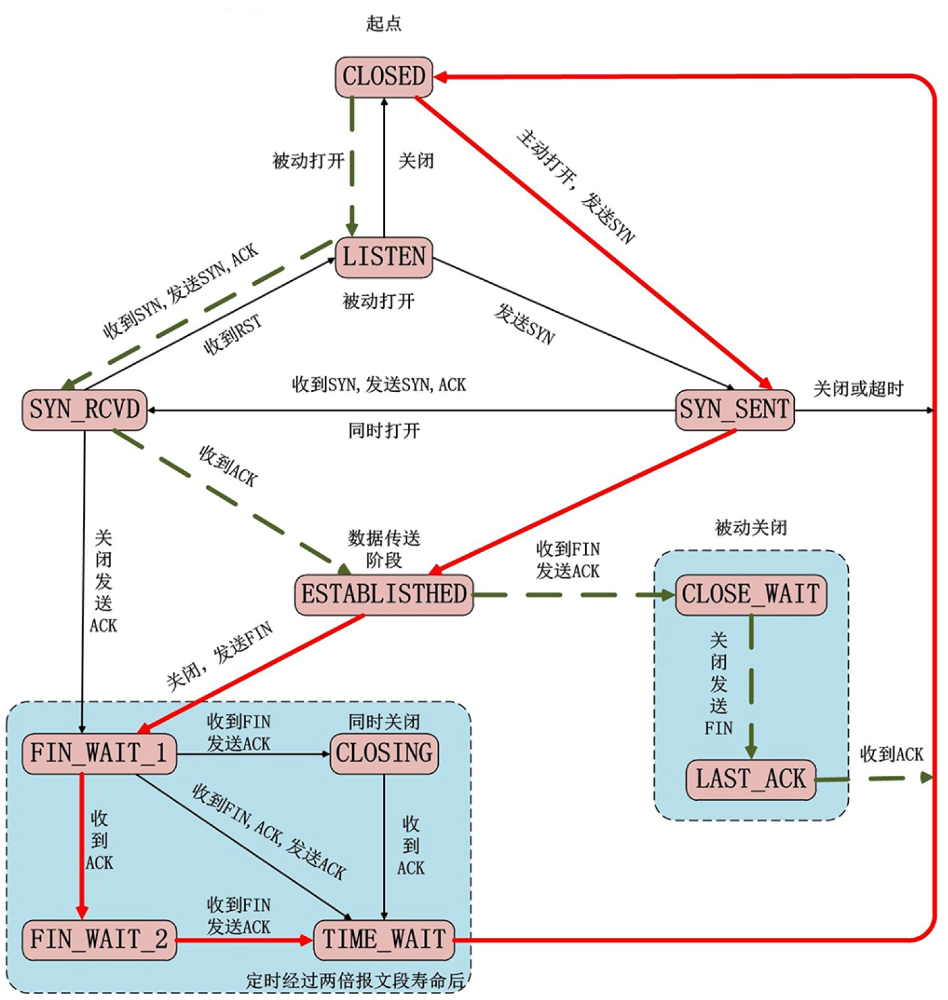

# 连接流程

三次握手发生在客户端连接的时候，当调用connect()，底层会通过TCP协议进行三次握手。

# TCP头部结构

值得注意的：
* 16位源端口号：TCP通信时，客户端通常使用系统自动选择的临时端口号。（客户端只要知道服务端的IP和端口就行）
* 32位序号（seq）：A和B通信，A发送给B的第一个 TCP 报文段中，序号值被系统初始化为某个随机值 ISN（Initial Sequence Number）。那么在该传输方向上（从 A 到 B），后续的 TCP 报文段中序号值将被系统设置成 ISN 加上该报文段所携带数据的第一个字节在整个字节流中的偏移。
* 32位确认号（ack）：用作对另一方发送来的 TCP 报文段的响应。其值是收到的 TCP 报文段的序号值 + 标志位长度（SYN，FIN） + 数据长度 。
* 4位头部长度：标识该 TCP 头部有多少个（4byte）。因为4位最大能表示 15，所以 TCP 头部最长是4*15=60byte
* 6位标志位
    * URG：表示紧急指针是否有效。
    * ACK：表示确认号是否有效。我们称携带 ACK 标志的 TCP 报文段为确认报文段。
    * PSH：提示接收端应用程序应该立即从 TCP 接收缓冲区中读走数据，为接收后续数据腾出空间（如果应用程序不将接收到的数据读走，它们就会一直停留在 TCP 接收缓冲区中）。
    * RST：表示要求对方重新建立连接。我们称携带 RST 标志的 TCP 报文段为复位报文段。
    * SYN：表示请求建立一个连接。我们称携带 SYN 标志的 TCP 报文段为同步报文段。
    * FIN：表示通知对方本端要关闭连接了。我们称携带 FIN 标志的 TCP 报文段为结束报文段。
* 16位窗口大小：TCP 流量控制。指的是接收通告窗口（Receiver Window，RWND）。它告诉对方本端的 TCP 接收缓冲区还能容纳多少字节的数据，这样对方就可以控制发送数据的速度。
* 16位校验和：由发送端填充，接收端对 TCP 报文段执行 CRC 算法以校验 TCP 报文段在传输过程中是否损坏。注意，这个校验不仅包括 TCP 头部，也包括数据部分。这也是 TCP 可靠传输的一个重要保障。
* 16位紧急指针：是一个正的偏移量。它和序号字段的值相加表示最后一个紧急数据的下一个字节的序号。因此，确切地说，这个字段是紧急指针相对当前序号的偏移，不妨称之为紧急偏移。TCP 的紧急指针是发送端向接收端发送紧急数据的方法。

# 三次握手

1. 第一次握手：
* 客户端将SYN标志位置为1
* 生成一个随机的32位的序号seq=J ， 这个序号后边是可以携带数据（数据的大小），这里没有数据。
2. 第二次握手：
* 服务器端接收客户端的连接： ACK=1
* 服务器会回发一个确认序号： ack=客户端的序号 + 数据长度 + SYN/FIN(按一个字节算)
* 服务器端会向客户端发起连接请求： SYN=1
* 服务器会生成一个随机序号：seq = K
3. 第三次握手：
* 客户单应答服务器的连接请求：ACK=1
* 客户端回复收到了服务器端的数据：ack=服务端的序号 + 数据长度 + SYN/FIN(按一个字节算)

# 滑动窗口
通信的双方都有发送缓冲区和接收数据的缓冲区。
* 接受方滑动窗口的大小意味着还有多大的缓冲区可以用于接收数据。
* 发送方可以通过滑动窗口的大小来确定应该发送多少字节的数据。当滑动窗口为 0 时，发送方一般不能再发送数据报。

滑动窗口是 TCP 中实现诸如 ACK 确认、流量控制、拥塞控制的承载结构。
窗口理解为缓冲区的大小。其大小会随着发送数据和接收数据而变化。
这意味着服务器和客户端都有发送缓冲区和接收缓冲区。

* 发送方的缓冲区：
    * 白：空闲的空间
    * 灰：数据已经被发送出去了，但是还没有被接收
    * 紫：还没有发送出去的数据
* 接收方的缓冲区：
    * 白：空闲的空间
    * 紫：已经接收到的数据

# 四次挥手
四次挥手发生在断开连接的时候，在程序中当调用了close()会使用TCP协议进行四次挥手。
客户端和服务器端都可以主动发起断开连接，谁先调用close()谁就是发起。

# 代码流程

主动断开连接的一方, 最后进入一个 TIME_WAIT 状态, 这个状态会持续2msl（一共60s左右）。这样就能够让 TCP 连接的主动关闭方在它发送的 ACK 丢失的情况下重新发送最终的 ACK。
主动关闭方重新发送的最终 ACK 并不是因为被动关闭方重传了 ACK（它们并不消耗序列号，被动关闭方也不会重传），而是因为被动关闭方重传了它的 FIN。事实上，被动关闭方总是
重传 FIN 直到它收到一个最终的 ACK。

* 半关闭状态
当 TCP 链接中 A 向 B 发送 FIN 请求关闭，另一端 B 回应 ACK 之后（A 端进入 FIN_WAIT_2 状态），并没有立即发送 FIN 给 A，A 方处于半连接状态，此时 A 可以接收 B 发送的数据（B应该只能发一次，第二次发收到SIGPIPE信号终止进程），但是 A 已经不能再向 B 发送数据。