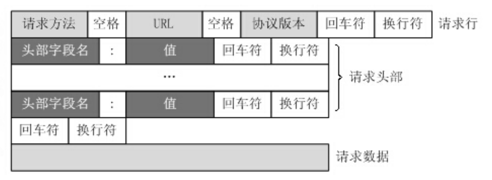
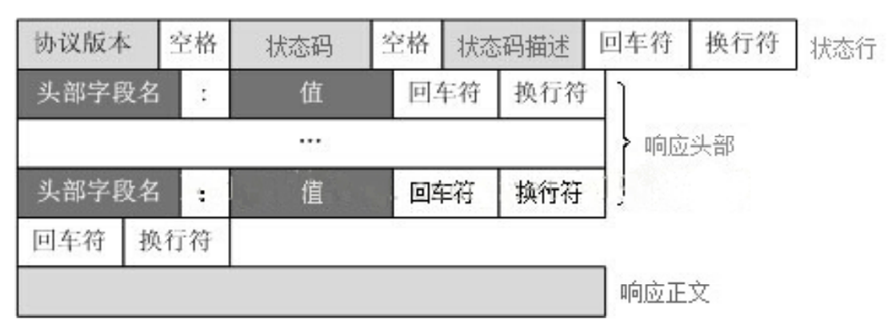

# HTTP 请求报文


## 请求方法
1. GET：向指定的资源发出“显示”请求。使用 GET 方法应该只用在读取数据。
2. HEAD：与 GET 方法一样，都是向服务器发出指定资源的请求。只不过服务器将不传回资源的本文部分。它的好处在于，使用这个方法可以在不必传输全部内容的情况下，就可以获取其中“关于该资源的信息”（元信息或称元数据）。
3. POST：向指定资源提交数据，请求服务器进行处理（例如提交表单或者上传文件）。数据被包含在请求本文中。这个请求可能会创建新的资源或修改现有资源，或二者皆有。
4. PUT：向指定资源位置上传其最新内容。
5. DELETE：请求服务器删除 Request-URI 所标识的资源。
6. TRACE：回显服务器收到的请求，主要用于测试或诊断。
7. OPTIONS：这个方法可使服务器传回该资源所支持的所有 HTTP 请求方法。用'*'来代替资源名称，向 Web 服务器发送 OPTIONS 请求，可以测试服务器功能是否正常运作。
8. CONNECT：HTTP/1.1 协议中预留给能够将连接改为管道方式的代理服务器。通常用于SSL加密服务器的链接（经由非加密的 HTTP 代理服务器）。

## 请求报文格式
* GET
``` xml
GET /index.jsp?id=100&op=bind HTTP/1.1\r\n（请求行）
Host: www.baidu.com\r\n（请求头部，每个KV之间都是\r\n作为间隔）
User-Agent: Mozilla/5.0 (Windows NT 10.0; Win64; x64; rv:86.0) Gecko/20100101 Firefox/86.0
Accept: text/html,application/xhtml+xml,application/xml;q=0.9,image/webp,/;q=0.8
Accept-Language: zh-CN,zh;q=0.8,zh-TW;q=0.7,zh-HK;q=0.5,en-US;q=0.3,en;q=0.2\r\n
Accept-Encoding: gzip, deflate, br\r\n
Connection: keep-alive\r\n
Cookie: BAIDUID=6729CB682DADC2CF738F533E35162D98:FG=1;
BIDUPSID=6729CB682DADC2CFE015A8099199557E; PSTM=1614320692; BD_UPN=13314752;
空行
请求数据（GET方式的请求一般不包含”请求内容”部分，请求数据以地址的形式表现在请求行）
```
地址中”?”之后的部分就是通过GET发送的请求数据，我们可以在地址栏中清楚的看到，各个数据之间用”&”符号隔开。显然，这种方式不适合传送私密数据。另外，由于不同的浏览器对地址的字符限制也有所不同，一般最多只能识别1024个字符，所以如果需要传送大量数据的时候，也不适合使用GET方式。

* POST

对于上面提到的不适合使用GET方式的情况，可以考虑使用POST方式，因为使用POST方法可以允许客户端给服务器提供信息较多。POST方法将请求参数封装在HTTP请求数据中，以名称/值的形式出现，可以传输大量数据，这样POST方式对传送的数据大小没有限制，而且也不会显示在URL中。
``` xml
POST /search HTTP/1.1\r\n
Host:www.wrox.com\r\n
User-Agent:Mozilla/4.0 (compatible; MSIE 6.0; Windows NT 5.1; SV1; .NET CLR 2.0.50727; .NET CLR 3.0.04506.648; .NET CLR 3.5.21022)\r\n
Content-Type:application/x-www-form-urlencoded
Content-Length:40
Connection: Keep-Alive
回车+换行
name=Professional%20Ajax&publisher=Wiley
```
可以看到，POST方式请求行中不包含数据字符串，这些数据保存在”请求内容”部分，各数据之间也是使用”&”符号隔开。POST方式大多用于页面的表单中。因为POST也能完成GET的功能，因此多数人在设计表单的时候一律都使用POST方式，其实这是一个误区。GET方式也有自己的特点和优势，我们应该根据不同的情况来选择是使用GET还是使用POST。

需要注意的是，在POST请求报文中，消息体的末尾没有任何字符


* 请求行：请求类型 + 要访问的资源 + 所使用的HTTP版本
* 请求头部，紧接着请求行（即第一行）之后的部分，用来说明服务器要使用的附加信息。
    * HOST：请求资源所在服务器的域名。
    * User-Agent：HTTP客户端程序的信息，该信息由你发出请求使用的浏览器来定义,并且在每个请求中自动发送等。
    * Accept：用户代理可处理的媒体类型。
    * Accept-Language：用户代理能够处理的自然语言集。
    * Accept-Encoding：用户代理支持的内容编码。
    * Connection：连接管理，可以是Keep-Alive或close。    
* 空行
* 请求数据

# HTTP响应报文


## 响应报文格式
``` xml
HTTP/1.1 200 OK
Connection: keep-alive
Content-Encoding: gzip
Content-Type（指定MIME的格式）: text/html;charset（编码类型）=utf-8
Date: Fri, 26 Feb 2021 08:44:35 GMT
Expires: Fri, 26 Feb 2021 08:44:35 GMT
空行
<html>
      <head></head>
      <body>
            响应数据
      </body>
</html>
```

## HTTP响应状态码
* 1xx：请求已被服务器接收，继续处理
* 2xx：请求已成功被服务器接收、理解、并接受
    * 200 OK：客户端请求被正常处理。
    * 206 Partial content：客户端进行了范围请求。
* 3xx：重定向
    * 301 Moved Permanently：永久重定向，该资源已被永久移动到新位置，将来任何对该资源的访问都要使用本响应返回的若干个URI之一。
    * 302 Found：临时重定向，请求的资源现在临时从不同的URI中获得。
* 4xx：客户端错误
    * 400 Bad Request：请求报文存在语法错误。
    * 403 Forbidden：请求被服务器拒绝。
    * 404 Not Found：请求不存在，服务器上找不到请求的资源。
* 5xx：服务器端错误
    * 500 Internal Server Error：服务器在执行请求时出现错误。


浏览器端发出http连接请求，主线程创建http对象接收请求并将所有数据读入对应buffer，将该对象插入任务队列，工作线程从任务队列中取出一个任务进行处理。(本篇讲)

工作线程取出任务后，调用process_read函数，通过主、从状态机对请求报文进行解析。(中篇讲)

解析完之后，跳转do_request函数生成响应报文，通过process_write写入buffer，返回给浏览器端。(下篇讲)